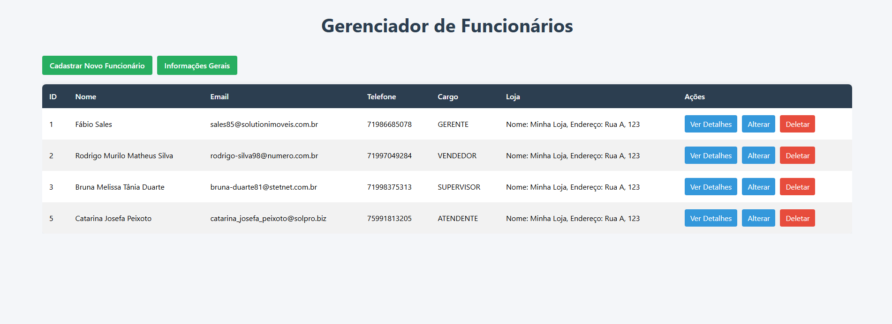
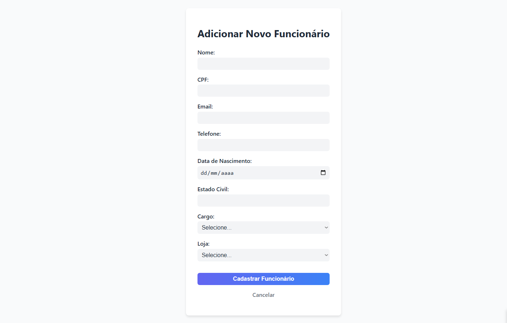
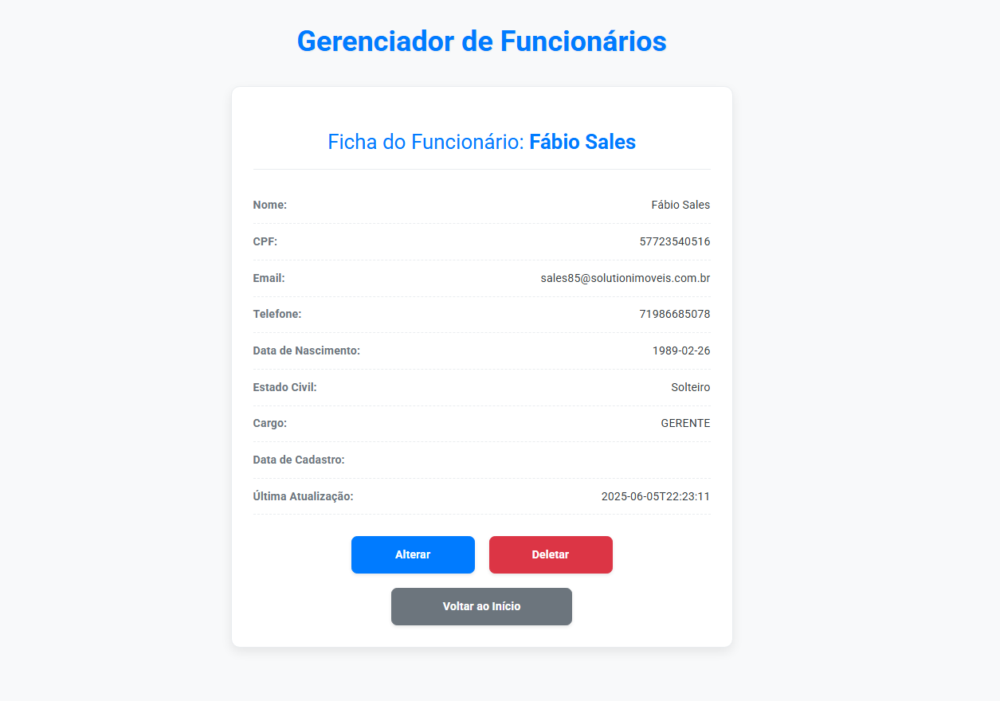

# 🏢 Sistema de Gerenciamento de Funcionários

Este projeto é uma aplicação web desenvolvida com **Spring Boot**, estruturada em camadas e com foco no **cadastro e gerenciamento de funcionários e lojas**. O sistema utiliza **H2** como banco de dados em memória, **Flyway** para controle de versões e migrações do banco de dados, e **Thymeleaf** para a criação das telas da interface do usuário (UI).

---

## 📋 Visão Geral do Projeto

Este sistema foi desenvolvido para gerenciar **Funcionários** e **Lojas**, com as seguintes regras:

- Cada funcionário pode ser associado a **uma única loja**.
- Cada loja pode ter **vários funcionários**.

### Funcionalidades

- ✅ Cadastro de funcionários com os seguintes campos:
  - `id`
  - `nome`
  - `cpf`
  - `email`
  - `telefone`
  - `dataNascimento`
  - `estadoCivil`
  - `cargo`
  - `dataCadastro`
  - `dataUpdate`
  - `loja`

- ✅ Cadastro de lojas
    - `id`
    - `nome`
    - `cnpj`
    - `endereco`

- ✅ Atribuição de uma loja para um funcionário
- ✅ Listagem e gerenciamento de funcionários e lojas
- ✅ Interfaces web criadas com **Thymeleaf** para uma UI dinâmica e responsiva

---

## 🛠️ Tecnologias Utilizadas

| Tecnologia           | Descrição                                                                 |
|----------------------|---------------------------------------------------------------------------|
| **Spring Boot**      | Framework principal para desenvolvimento da aplicação                     |
| **Spring Data JPA**  | Interação com o banco de dados via ORM                                    |
| **H2 Database**      | Banco de dados em memória para desenvolvimento e testes                   |
| **Flyway**           | Migrações de banco de dados versionadas                                   |
| **Maven**            | Gerenciamento de dependências e build                                     |
| **Git/GitHub**       | Controle de versão e hospedagem do repositório                            |
| **Java 17+**         | Linguagem utilizada no projeto                                             |
| **SQL**              | Criação e manipulação das estruturas do banco de dados                    |

---

## 🔄 Endpoints da Aplicação

### 📁 Funcionários

| Método | Endpoint                  | Descrição                          |
|--------|---------------------------|------------------------------------|
| GET    | `/funcionarios/listar`       | Lista todos os funcionários        |
| GET    | `/funcionarios/listar/{id}`  | Retorna os dados de um funcionário específico |
| POST   | `/funcionarios/cadastrar`       | Cria um novo funcionário           |
| PUT    | `/funcionarios/alterarID/{id}`  | Atualiza um funcionário existente  |
| DELETE | `/funcionarios/deletar/{id}`  | Remove um funcionário              |

#### 📥 Exemplo de JSON para criação de funcionário:

```json
{
  "nome": "João Silva",
  "cpf": "12345678900",
  "email": "joao.silva@email.com",
  "telefone": "71912345678",
  "dataNascimento": "1990-05-20",
  "estadoCivil": "SOLTEIRO",
  "cargo": "Vendedor",
  "lojaId": 1
}
```
#### 📤 Exemplo de JSON para Resposta de funcionário:

```json
{
    "id": 1,
    "nome": "Fábio Sales",
    "cpf": "57723540516",
    "email": "sales85@solutionimoveis.com.br",
    "telefone": "71986685078",
    "dataNascimento": "1989-02-26",
    "estadoCivil": "Solteiro",
    "cargo": "GERENTE",
    "dataCadastro": "2025-06-05T22:23:11",
    "dataUpdate": "2025-06-05T22:23:11",
    "lojas": {
      "id": 1,
      "nome": "Minha Loja",
      "cnpj": "12345678000199",
      "endereco": "Rua A, 123"
    }
  }
```


### 🏬 Lojas

| Método | Endpoint                        | Descrição                                  |
|--------|----------------------------------|--------------------------------------------|
| GET    | `/lojas/lojas/listar`                    | Lista todas as lojas                       |
| GET    | `/lojas/listar/{id}`               | Retorna os dados de uma loja específica    |
| POST   | `/lojas/cadastrar`                    | Cria uma nova loja                         |
| PUT    | `/lojas/alterarID/{id}`               | Atualiza os dados de uma loja              |
| DELETE | `/lojas/deletarID`               | Remove uma loja                            |

#### 📥 Exemplo de JSON para criação de loja:

```json
 {
    "nome": "Material de Construção",
    "cnpj": "12345678000122",
    "endereco": "Rua B, 123",
  }
```
#### 📤 Exemplo de JSON para Resposta de funcionário:

```json
 {
    "id": 33,
    "nome": "Material de Construção",
    "cnpj": "12345678000122",
    "endereco": "Rua B, 123",
    "funcionarios": []
  }
```

## 🖥️ Telas da Aplicação (UI)

A aplicação conta com uma interface web desenvolvida utilizando **Thymeleaf** para renderização dinâmica das páginas. As principais telas disponíveis são:

- **Página inicial:**  
  Visão geral do sistema e navegação entre módulos com todos os funcionários cadastrados.  
  

- **Cadastro de Funcionários:**  
  Formulário para criar e editar funcionários.  
  

- **Detalhes do Funcionário:**  
  Página detalhada com informações completas do funcionário e loja associada.  
  

Todas as páginas seguem um padrão responsivo e simples, permitindo fácil navegação e usabilidade.

---

## 🚀 Melhorias Futuras

Alguns pontos que podem ser adicionados ou melhorados nas próximas versões do sistema:

- 🔒 **Autenticação e autorização**: Implementar controle de acesso com Spring Security para diferentes perfis de usuário (admin, gerente, funcionário).
- 📱 **Design responsivo aprimorado**: Otimizar a interface para dispositivos móveis e tablets.
- 🧹 **Validações e tratamento de erros**: Adicionar validações mais robustas no frontend e backend, além de mensagens de erro amigáveis.
- 📊 **Relatórios e dashboards**: Criar relatórios gerenciais e dashboards para análise dos dados de funcionários e lojas.
- 🔔 **Notificações**: Implementar sistema de notificações via email ou dentro da aplicação.
- 🌐 **Internacionalização (i18n)**: Suporte a múltiplos idiomas para atender usuários de diferentes regiões.
- ⚙️ **Integração com API externa**: Possibilidade de integrar com serviços externos, como sistemas de folha de pagamento ou CRM.
- 💾 **Persistência em banco de dados real**: Configurar para utilização de bancos como MySQL, PostgreSQL em produção.
- 🧪 **Testes automatizados**: Adicionar testes unitários, de integração e de UI para garantir a qualidade do sistema.
- 🛠️ **Melhorias na UI/UX**: Implementar temas, dark mode, e melhorias na experiência do usuário.
- 🎨 **Implementação de Front-end Moderno**: Migrar ou integrar a camada de visualização para frameworks modernos de front-end como React, Angular ou Vue.js para uma experiência mais dinâmica e interativa.

Fique à vontade para contribuir com pull requests ou abrir issues com sugestões!

---

## ✨ Considerações Finais

Este projeto foi desenvolvido como um estudo inicial para entender e aplicar conceitos fundamentais de desenvolvimento com **Spring Boot**, arquitetura em camadas e integração com banco de dados.  

Ainda há muito espaço para melhorias, implementações e aprimoramentos, e a intenção é evoluir continuamente essa aplicação para torná-la mais robusta, completa e amigável ao usuário.

Contribuições, feedbacks e sugestões são sempre bem-vindos para tornar este projeto ainda melhor!

Obrigado por visitar e explorar este repositório! 🚀
